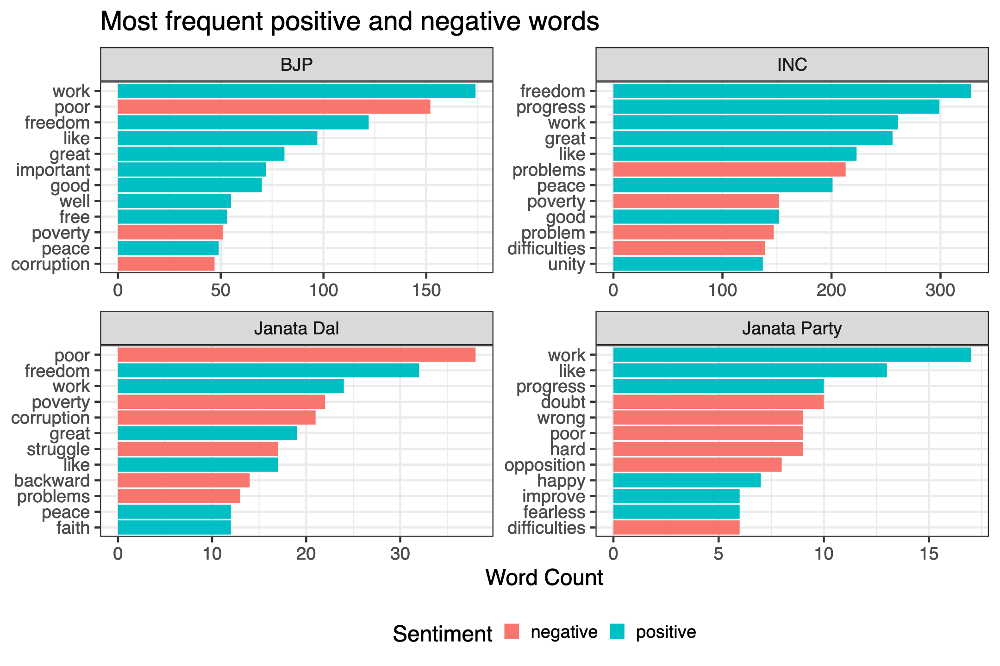

<!-- README.md is generated from README.Rmd. Please edit that file -->

```{r, include = FALSE}
knitr::opts_chunk$set(
  collapse = TRUE,
  comment = "#>",
  fig.path = "man/figures/README-",
  out.width = "100%"
)
```

# aug15 - Data set of Indian Independence Day Speeches

<!-- badges: start -->
<!-- badges: end -->

This package includes a data set of full-text English renderings of Indian Independence Day speeches, delivered annually on 15 August since 1947. 

Recent speeches are easily found online from the [Press Information Bureau](https://pib.gov.in). For older speeches, I was able to find them in volumes of collected speeches in the libraries of Jawaharlal Nehru University and the Nehru Memorial Museum. Speeches in those volumes were digitized by uploading images to Google Drive's native OCR feature.

The data set is only missing speeches from 1962 and 1995. Please contact me if you're able to find the speech for those years! Or evidence of one not taking place.

## Installation

You can access the data set by installing the package from GitHub. 

``` r
# install.packages("devtools")
devtools::install_github("seanangio/aug15")
```

The data set is called ``corpus``. To preview it, run something like:

```{r example, message=FALSE}
library(dplyr)
library(aug15)
glimpse(corpus)
```

Alternatively, you can directly download the [CSV file](https://github.com/seanangio/aug15/tree/main/inst/final_csv) or browse any of the speeches in this [folder](https://github.com/seanangio/aug15/tree/main/inst/extdata).

## Investigation

For a brief investigation into the data set, this package includes a [shiny app](https://github.com/seanangio/aug15/tree/master/inst/examples/analysis_app) to make basic visualizations, including plots of:

* speech length


* most 'important' words (TF-IDF)


* most frequent positive and negative words (according to the Bing lexicon)



* net sentiment (according to the Bing lexicon)


* and the frequency of any word supplied by the user


## Python Port

A Python implementation of the analysis app is also available, built with Streamlit. It provides the same visualizations and functionality as the R Shiny app. For installation and usage instructions, see the [Python README](python/README.md).

