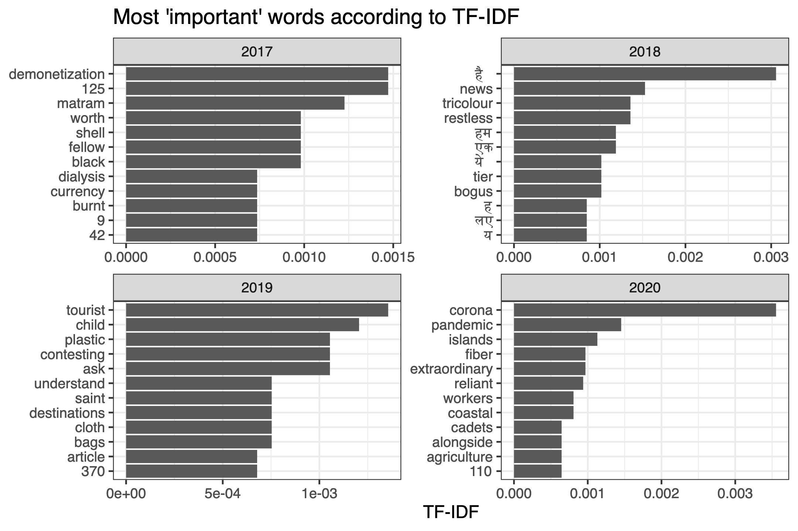

<!-- README.md is generated from README.Rmd. Please edit that file -->

# aug15 - Data set of Indian Independence Day Speeches

<!-- badges: start -->

<!-- badges: end -->

This package includes a data set of full-text English renderings of
Indian Independence Day speeches, delivered annually on 15 August since
1947.

Recent speeches are easily found online from the [Press Information
Bureau](https://pib.gov.in). For older speeches, I was able to find them
in volumes of collected speeches in the libraries of Jawaharlal Nehru
University and the Nehru Memorial Museum. Speeches in those volumes were
digitized by uploading images to Google Drive’s native OCR feature.

The data set is only missing speeches from 1962 and 1995. Please contact
me if you’re able to find the speech for those years! Or evidence of one
not taking place.

## Installation

You can access the data set by installing the package from GitHub.

``` r
# install.packages("devtools")
devtools::install_github("seanangio/aug15")
```

The data set is called `corpus`. To preview it, run something like:

``` r
library(dplyr)
library(aug15)
glimpse(corpus)
#> Rows: 79
#> Columns: 8
#> $ year     <dbl> 2025, 2024, 2023, 2022, 2021, 2020, 2019, 2018, 2017, 2016, 2…
#> $ pm       <chr> "Narendra Modi", "Narendra Modi", "Narendra Modi", "Narendra …
#> $ party    <chr> "BJP", "BJP", "BJP", "BJP", "BJP", "BJP", "BJP", "BJP", "BJP"…
#> $ title    <chr> NA, NA, NA, NA, NA, NA, NA, NA, NA, NA, NA, NA, NA, NA, NA, N…
#> $ footnote <chr> "English rendering of Prime Minister Shri Narendra Modi's add…
#> $ source   <chr> "Press Information Bureau", "Press Information Bureau", "Pres…
#> $ url      <chr> "https://pib.gov.in/", "https://pib.gov.in/", "https://pib.go…
#> $ text     <chr> "My dear countrymen,\n\nThis grand festival of Independence i…
```

Alternatively, you can directly download the [CSV
file](https://github.com/seanangio/aug15/tree/main/inst/final_csv) or
browse any of the speeches in this
[folder](https://github.com/seanangio/aug15/tree/main/inst/extdata).

## Investigation

For a brief investigation into the data set, this package includes a
[shiny
app](https://github.com/seanangio/aug15/tree/master/inst/examples/analysis_app)
to make basic visualizations, including plots of:

- speech length

<figure>

<figcaption aria-hidden="true">Plot of speech word count</figcaption>
</figure>

- most ‘important’ words (TF-IDF)

<figure>

<figcaption aria-hidden="true">Plot of TF-IDF for recent
years</figcaption>
</figure>

- most frequent positive and negative words (according to the Bing
  lexicon)

<figure>

<figcaption aria-hidden="true">Plot of most frequent positive and
negative words</figcaption>
</figure>

- net sentiment (according to the Bing lexicon)

<figure>

<figcaption aria-hidden="true">Plot of net sentiment</figcaption>
</figure>

- and the frequency of any word supplied by the user

<figure>

<figcaption aria-hidden="true">Plot of frequency of the term
Kashmir</figcaption>
</figure>

## Python Port

A Python implementation of the analysis app is also available, built
with Streamlit. It provides the same visualizations and functionality as
the R Shiny app. For installation and usage instructions, see the
[Python README](python/README.md).
